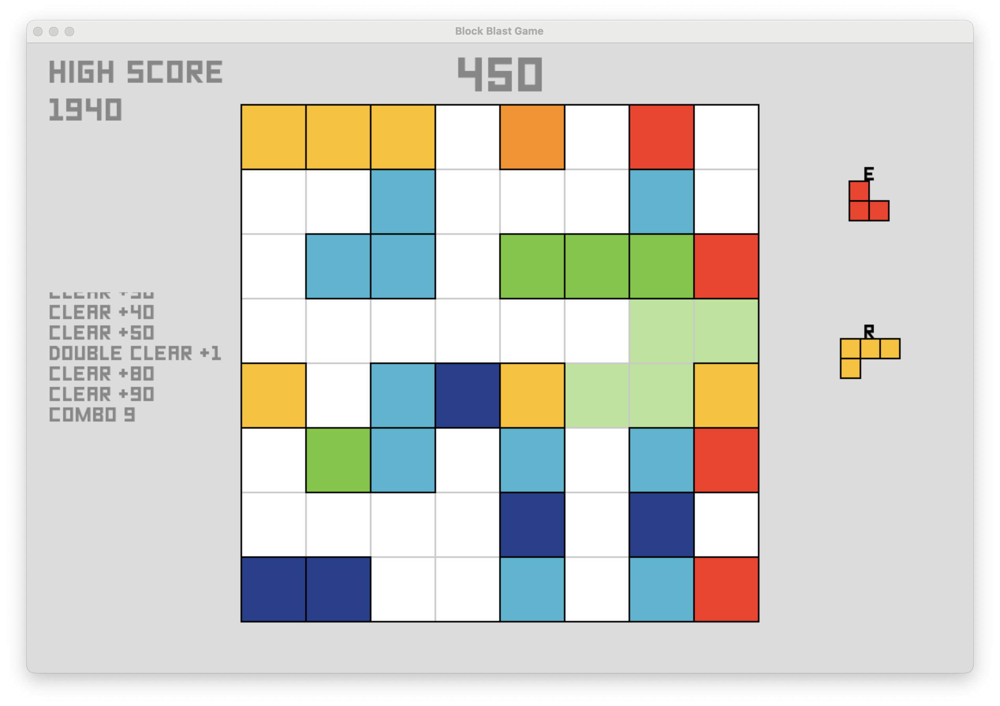

# Block Blast Game + Reinforcement Learning AI Agent

Block Blast is a Tetris-inspired puzzle game played on an 8×8 grid. At each turn, the player (or agent) is presented with three randomly generated block shapes and must choose one to place anywhere on the board. Whenever an entire row or column is filled, it clears and awards points; clearing multiple lines in succession activates a combo multiplier for even higher scores.

Under the hood, the game engine guarantees that at least one of the three available shapes can always be placed, ensuring no unwinnable states arise prematurely. A Pygame-based interface lets humans play and test strategies interactively, while a custom OpenAI Gym environment exposes the game’s state, action space, and reward function for Reinforcement Learning.

This repository implements several RL agents—including a random baseline, Deep Q-Network (DQN), Proximal Policy Optimization (PPO), and a masked-action PPO variant—to train and evaluate performance. Comprehensive scripts are provided to train agents, log metrics, visualize results, and compare different approaches under consistent conditions.

<p align="center">
  
</p>

---

## 📋 Table of Contents

- [Features](#-features)
- [Project Structure](#-project-structure)
- [Requirements](#-requirements)
- [Installation](#-installation)
- [Usage](#-usage)

  - [Human Play](#human-play)
  - [Training Agents](#training-agents)
  - [Comparing Agents](#comparing-agents)

- [Reinforcement Learning Environment](#-reinforcement-learning-environment)
- [Algorithms](#-algorithms)
- [Contributing](#-contributing)
- [Results & Analysis](#-results--analysis)
- [Future Work](#-future-work)
- [Credits](#-credits)
- [License](#-license)

---

## 🚀 Features

- **Custom Gym Env**: Fine-tuned observation, action space, and rewards.
- **Action Masking**: Prevents invalid moves for PPO & DQN.
- **Multiple Agents**:
  - Random (baseline)
  - PPO (with/without masking)
  - DQN
- **Visualization**: TensorBoard logs, matplotlib plots of performance.
- **Human Interface**: Pygame-based play via keyboard & mouse.

---

## 📂 Project Structure

```
BlockBlast-Game-AI-Agent/
├── agent_comparison/      # Simulation & comparison scripts
│   ├── simulate_playing.py
│   └── results/           # CSVs & plots
├── agents/                # RL agents & models
│   ├── models/            # Saved checkpoints
│   ├── dqn_agent.py
│   ├── dqn_masked_agent.py
│   ├── ppo_agent.py
│   ├── ppo_masked_agent.py
│   └── random_agent.py
├── blockblast_game/       # Game environment & assets
│   ├── game_env.py
│   ├── game_renderer.py
│   ├── game_state.py
│   └── Assets/            # Sprites & images
├── human_play/            # Human‐play wrapper
│   └── human_play.py
├── requirements.txt
└── README.md
```

---

## ⚙️ Requirements

- Python 3.8+
- [Pygame](https://www.pygame.org/news)
- [Gym](https://github.com/openai/gym)
- [Stable Baselines3](https://github.com/DLR-RM/stable-baselines3)
- `pip install -r requirements.txt`

---

## 🔧 Installation

1. **Clone the repo**

   ```bash
   git clone https://github.com/RisticDjordje/BlockBlast-Game-AI-Agent.git
   cd BlockBlast-Game-AI-Agent
   ```

2. **Create & activate a virtual environment**

   ```bash
   python3 -m venv venv
   source venv/bin/activate    # macOS/Linux
   venv\Scriptsctivate       # Windows
   ```

3. **Install dependencies**
   ```bash
   pip install -r requirements.txt
   ```

---

## 💻 Usage

**Ensure you are running all commands from the root directory of the project to avoid import errors due to sibling folder structure.**

### Human Play

```bash
python -m human_play.human_play
```

- **E, R, T**: Select piece
- **Mouse hover**: Preview placement
- **Left-click / SPACE**: Place piece
- **ESC**: Restart

---

### Training Agents

Make sure you’re in the project root (so `blockblast_game/` and `agents/` are on your `PYTHONPATH`) and your virtualenv is activated.

## DQN

- **Standard DQN**
  ```bash
  python -m agents.dqn_agent
  ```
- **Masked DQN**
  ```bash
  python -m agents.dqn_masked_agent
  ```

## PPO

- **Standard PPO**
  ```bash
  python -m agents.ppo_agent
  ```
- **Masked PPO**
  ```bash
  python -m agents.ppo_masked_agent
  ```

Each script supports flags at the top of the file (e.g. `do_train`, `do_visualize`, `total_timesteps`, `continue_training`)—just edit those or wire in an `argparse` wrapper if you’d like CLI control.

---

### Comparing Agents

1. **Simulate games**

   ```bash
   python -m agent_comparison.simulate_playing
   ```

   → CSV in `agent_comparison/results/`

2. **Visualize results**
   ```bash
   python -m agent_comparison.visualize_results
   ```
   → Performance plots in `agent_comparison/results/`

---

## 🏗 Reinforcement Learning Environment

- **Observation**:
  - 8×8 grid (0/1)
  - 3× 5×5 piece matrices
  - Current score & combo count
- **Action Space**: 3 shapes × 64 positions → 192 discrete actions
- **Reward Design** (example although I have tried many different combinations):
  - Valid placement: +0.2
  - Invalid: –2.5 (escalating penalties)
  - Line clear: +1.5 / line
  - Game over: –20

---

## 🤖 Algorithms

1. **Random Agent**
2. **PPO** (Clipped Policy Gradient)
3. **DQN** (Value-based with Replay & Target Network)
4. **Masked PPO** (invalid‐action masking)

See inline docstrings for hyperparameters and architecture details.

---

## 🤝 Contributing

Contributions are what make the open source community such an amazing place to learn, inspire, and create. I welcome improvements, bug fixes, new features, and documentation enhancements! Feel free to start a discussion by opening an issue if you have questions or want to propose larger changes.

### How to Contribute

1. **Fork the repository** to your own GitHub account.
2. **Clone your fork** locally:
   ```bash
   git clone https://github.com/YourUserName/BlockBlast-Game-AI-Agent.git
   cd BlockBlast-Game-AI-Agent
   ```
3. **Create a new branch** for your work with a descriptive name (feature, bugfix, etc.):
   ```bash
   git checkout -b feature/YourFeatureName
   ```
4. **Make your changes** in your branch.
5. **Commit with clear, descriptive messages**:

   - Use imperative mood (e.g., “Add”, “Fix”, “Update”).

   **Commit message style examples:**

   ```bash
   feat(game): add action masking for PPO agent
   fix(renderer): correct sprite alignment in preview mode
   docs(readme): update contributing section with commit guidelines
   ```

6. **Push your branch** to GitHub:
   ```bash
   git push origin feature/YourFeatureName
   ```
7. **Open a Pull Request** against the `main` branch of this repository. In your PR description, include:
   - A summary of your changes.
   - Any related issue numbers.
   - Screenshots or GIFs when relevant (before-and-after visuals help reviewers).

We appreciate every contribution—big or small. Thank you for helping make Block Blast even better!

---

## 📊 Results & Analysis

- **DQN and PPO**: both struggle with the large action space of the game and I have not been able to get the agents to learn not to place pieces in invalid positions.
- I have solved this by introducing action masking. Masked PPO avoids invalid moves and gains higher average rewards compared to an agent that plays randomly among the valid moves.

---

## 🔭 Future Work

- Action‐masking for DQN
- Hyperparameter sweeps & longer training
- Deploy a [public “BlockBlast Solver”](https://github.com/RisticDjordje/BlockBlast-Solver-Website) website with a MLOps pipeline

---

## 🙏 Credits

- **Game Assets**: [Kefrov’s Blast](https://github.com/Kefrov/Blast/)  
  Everything else, including game logic, agent training, and analysis, is original work.

---

## 📄 License

This project is licensed under the MIT License.
